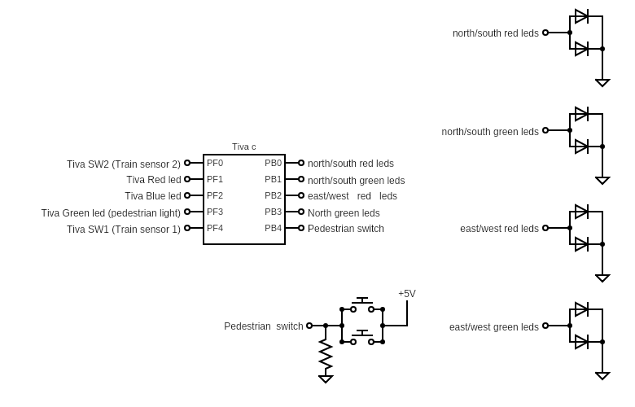

### Traffic control system with pedestrian and train mode
#### There are three operation modes
**normal mode** where traffic switches direction from north/south to east/west every tgn, tgw defined at the top main

**pedestrian mode** where through two button connected on bread board that let pedestrain pass for tcross period then goes back to normal operation

**train mode** where the two switches on the tiva act as sensor for the train when one is pressed red light flash for tsafety period and then the system waits for second sensor/switch to be triggred indicating that train has passed, then resumes normal operation.

### Diagram

### Demo video
 
[Watch the video](https://youtu.be/TMZM-_7zIsc)
